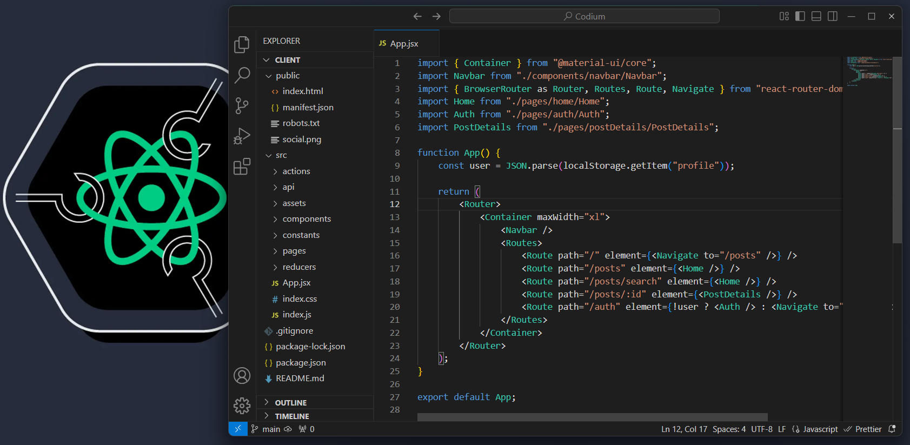

<div id="vscodium-logo" align="center">
    
    <h1>Codium</h1>
    <h3>A Text Editor built on Tauri.</h3>
</div>

<div id="vscodium-logo" align="center">
    
    
</div>

### 0.0.4 (Currently working):

- [x] Migrate to Zustand from Redux
- [x] Use shadcn/ui
- [ ] Migrate to monaco from codemirror

ToDo:

- [ ] Add Unsaved File alert
- [ ] Fix context menu
- [ ] Add Terminal
- [ ] Add Search
- [ ] Add Git

## Recommended Setup To Work in Windows

- [Desktop development with c++](https://learn.microsoft.com/en-us/cpp/build/vscpp-step-0-installation?view=msvc-170) + [Rust](https://www.rust-lang.org/tools/install)
- [VS Code](https://code.visualstudio.com/) + [Tauri](https://marketplace.visualstudio.com/items?itemName=tauri-apps.tauri-vscode) + [rust-analyzer](https://marketplace.visualstudio.com/items?itemName=rust-lang.rust-analyzer)

## To Run

```properties
npm i
npm run tauri dev
```

## To Build

```properties
npm run tauri build
```
